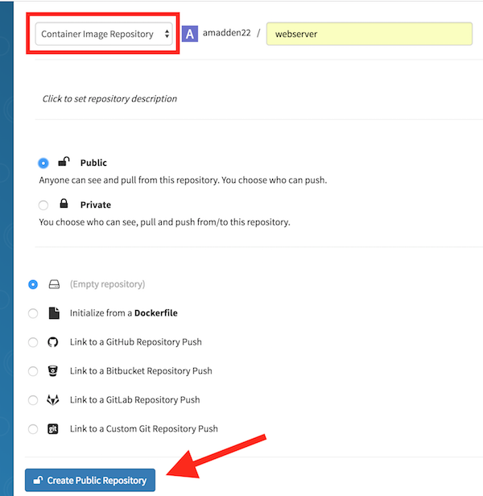

= Quay Repository Creation
ifdef::env-github[]
:imagesdir: ../assets/
endif::[]

This guide serves as a demonstration for creating a new container repository in https://quay.io[Quay]

== Prerequisites: 
Quay.io account - you can register for a Quay account https://quay.io/signin/[here]

Docker installed - follow Docker's https://docs.docker.com/install/[documentation] to find the correct installation for your system

== Step One: Create Repository
Click on "Create New Repository" 

image::new_repo.png[]

Set the repository type to "Container Image Repository" and give it a name. Set the repository to public and empty. Then click "Create Public Repository"

== Step Two: Build and Push Container

== Step Three: Pull Container

