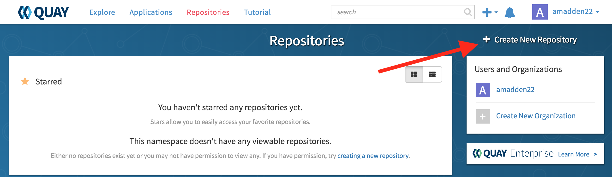
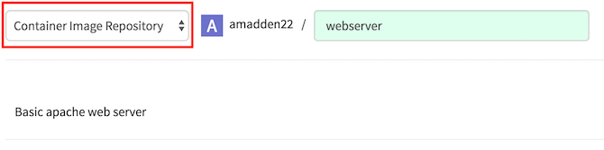
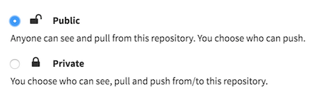
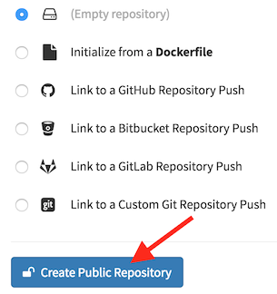

= Quay Repository Creation
ifdef::env-github[]
:imagesdir: ../assets/
endif::[]

This guide serves as a demonstration for creating a new container repository in https://quay.io[Quay]

== Prerequisites: 
Quay.io account - you can register for a Quay account https://quay.io/signin/[here]

Docker installed - follow Docker's https://docs.docker.com/install/[documentation] to find the correct installation for your system

== Step One: Create Repository
*_Click on "Create New Repository"_*

---

*_Set type to "Container Image Repository" and input a repository name. Optionally, add a description._*

---

*_Set the repository to public_*

---
*_Initialize as empty. Then click "Create Public Repository"_*

---
== Step Two: Build Container

== Step Three: Push Container

== Step Four: Pull Container

